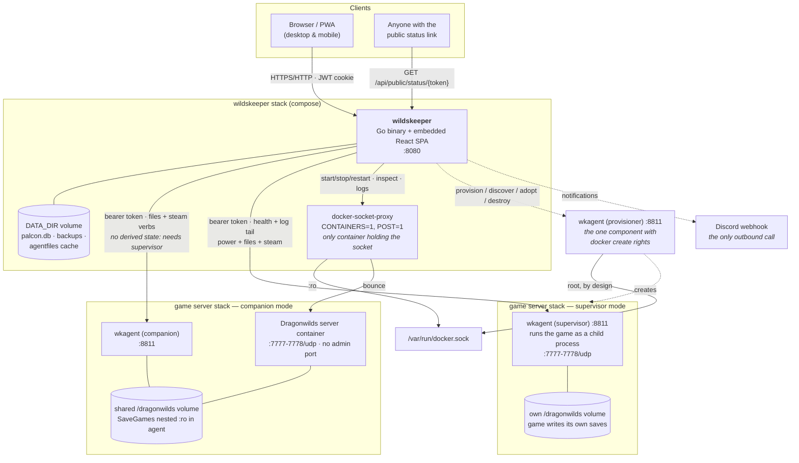
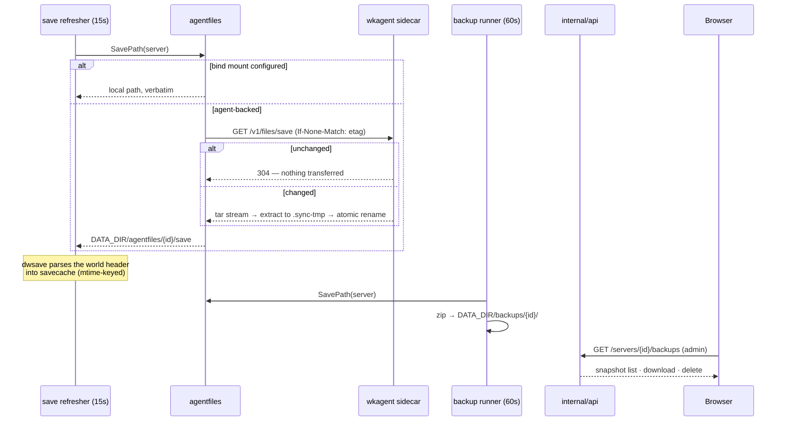
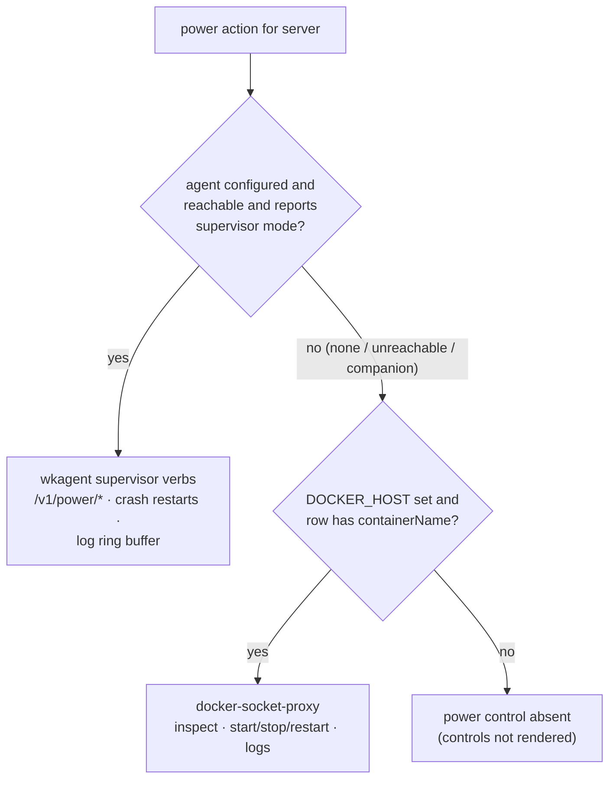
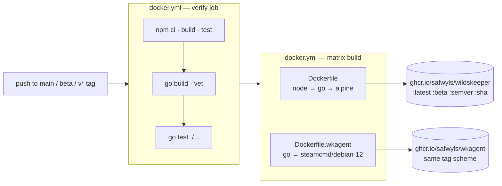

# Wildskeeper architecture

This is the map of the system: what the pieces are, how they talk to each
other, and where the boundaries are drawn. It cross-references the deeper
docs where they exist — [`sidecar-agent.md`](sidecar-agent.md) for the agent
design, [`porting-to-another-game.md`](porting-to-another-game.md) for the
game abstraction's edges, [`visibility.md`](visibility.md) for the privacy
model, [`dragonwilds-recon.md`](dragonwilds-recon.md) for the verified game
facts every parser and capability decision rests on.

In one sentence: **wildskeeper is a single Go binary acting as a pure control
plane** — it holds no docker socket, never writes a game save, and reaches
game servers only through a per-server sidecar agent or a scoped docker
proxy — serving an embedded React SPA that polls a JSON API.

Inherited from palcon, its Palworld sibling, and kept structurally
identical so fixes can travel between them. Where this document says
something game-shaped, Dragonwilds is the game: no RCON, no REST, no query
protocol, so the agent is not an optional convenience here — it is the
only transport.

## Contents

- [Tech stack](#tech-stack)
- [System context & deployment](#system-context--deployment)
- [Backend component architecture](#backend-component-architecture)
- [Startup wiring & background loops](#startup-wiring--background-loops)
- [The game abstraction](#the-game-abstraction)
- [API layer: auth & permissions](#api-layer-auth--permissions)
- [Data layer](#data-layer)
- [The save pipeline](#the-save-pipeline)
- [Power control & the stop sequence](#power-control--the-stop-sequence)
- [wkagent: the sidecar](#wkagent-the-sidecar)
- [Frontend](#frontend)
- [Build, CI & publishing](#build-ci--publishing)
- [Cross-cutting design rules](#cross-cutting-design-rules)

## Tech stack

| Layer | Choice | Why |
|---|---|---|
| Backend | Go 1.26, one module, **two binaries** (`cmd/wildskeeper`, `cmd/wkagent`) | Single static binary per role; shared internal packages so file operations behave identically whichever side executes them |
| HTTP router | chi v5 | Small, stdlib-shaped |
| Auth | golang-jwt v5 (HS256, pinned), bcrypt via `x/crypto` | JWT in an HttpOnly cookie; no server-side session table |
| Database | SQLite via `modernc.org/sqlite` (pure Go) | No cgo → `CGO_ENABLED=0` builds and an alpine runtime with no glibc; one file in `DATA_DIR` (still named `palcon.db` — the inherited filename, kept so an upgraded deployment finds its data) |
| Secrets at rest | AES-256-GCM (`internal/crypto`) | Agent tokens — and the inherited RCON/REST password columns no game fills today — encrypted in the DB |
| Save parsing | `dwsave` (pure Go) | Reads the world metadata out of the SPUD container (`internal/games/dragonwilds/dwsave`), verified against a real capture. Object-level state (players, inventories) is still unparsed — the reader covers the INFO header and level names, not the world's contents |
| Frontend | React 18 + TypeScript 5.5, Vite 5 | SPA embedded into the Go binary via `go:embed` |
| Server state | TanStack Query v5 — the only state manager | REST + polling everywhere; no websockets, no SSE, no Redux |
| Styling | Tailwind 3.4 + shadcn-style components over Radix primitives | One Wildskeeper theme (deep night, brass, rune-cyan) with no light/dark toggle; installable PWA (manifest-only, no service worker) |
| Game transports | The wkagent sidecar, and nothing else | Dragonwilds has no RCON, no REST and no query protocol. `internal/rcon` (with its `rcontest` fake) still ships, imported by nothing but its own tests — the inherited transport, kept for the next game rather than deleted |
| Container control | Docker Engine HTTP API via `tecnativa/docker-socket-proxy` | wildskeeper never holds the socket; the proxy allows exactly inspect + start/stop/restart |
| Images | `ghcr.io/safwyls/wildskeeper` (alpine) and `ghcr.io/safwyls/wkagent` (steamcmd/debian) | Two images, one repo, same tag scheme |

Go direct dependencies number six: chi, golang-jwt, `x/crypto`,
modernc.org/sqlite, and the two model SDKs (`anthropic-sdk-go`,
`google.golang.org/genai`) that only `internal/advisor` uses. Everything else
is stdlib.

## System context & deployment

The reference deployment is compose stacks on one Docker host (TrueNAS Scale
being the documented case), but each game server's stack can equally live on
a **different host** — that is what the agent exists for. The structural
rule from `sidecar-agent.md`: wildskeeper's stack and each game server's stack
are separate compose files joined by a shared external network, so
`docker compose down` on wildskeeper can never take a game server with it.

The game binds one UDP port and the port immediately above it — 7777 and
7778 by default — and nothing else. There is no admin port to publish,
which is exactly why every arrow into a game stack goes through the agent's
:8811 instead.

Companion mode is a real but *partial* mode here: it serves files and
SteamCMD verbs, and power still runs through the docker proxy, but the
Dragonwilds client refuses it outright — with no process to observe, the
agent's health reports no game and there is nothing to derive liveness or a
player list from. Supervisor mode is what lights the dashboard up.

Reading the trust gradient left to right: the browser gets a cookie; wildskeeper
gets fixed verbs on the proxy and on each agent; only the proxy and the
optional provisioner ever touch the docker socket, and the proxy holds it
read-only with two API classes enabled. A fully compromised wildskeeper can
bounce game servers and touch agent-scoped files — it cannot create
containers, mount volumes, or reach host root. The provisioner is the
documented, deliberate exception ([`sidecar-agent.md`](sidecar-agent.md)
covers the risk model; it degrades to a copy-paste flow when absent).

Bind mounts remain a fully supported mode for same-host setups, but only
for *files*: save directory mounted read-only, config directory mounted
read-write as a deliberately separate mount. Backups and the ini editor
work off those with no agent involved. Liveness and the player list still
cannot — they have no source but the agent.

## Backend component architecture

The repo is split into a **game-agnostic core** — none of it knows what
Dragonwilds is — and **per-game implementations** that plug in through a
registry. The moderation, power, metrics, scheduling and watchdog paths are
written purely against the `internal/game` contracts.

```mermaid
flowchart TB
    subgraph entry["entrypoints"]
        cmdwildskeeper["cmd/wildskeeper"]
        cmdwkagent["cmd/wkagent"]
    end

    subgraph core["game-agnostic core"]
        api["internal/api<br/>HTTP handlers · auth · permissions · routing"]
        gamepkg["internal/game<br/>Client · ExtendedClient · Definition · registry"]
        store["internal/store<br/>servers · users · metrics · row→client bridge"]
        db["internal/db<br/>sqlite + embedded migrations"]
        crypto["internal/crypto<br/>AES-GCM box"]
        collector["internal/collector<br/>metrics sampling · save refresher"]
        sched["internal/sched<br/>scheduled restarts"]
        watchdog["internal/watchdog<br/>crash revival"]
        backup["internal/backup<br/>save snapshots"]
        notify["internal/notify<br/>Discord webhooks"]
        dockerctl["internal/dockerctl<br/>docker API client (proxy-shaped)"]
        agentctl["internal/agentctl<br/>wkagent client"]
        agentfiles["internal/agentfiles<br/>save/config path resolver + sync cache"]
        savecache["internal/savecache<br/>mtime-keyed parse cache<br/>Source: dwsave"]
        rcon["internal/rcon<br/>Source RCON wire protocol<br/><i>no importer</i>"]
        steamcmd["internal/steamcmd<br/>cache clear + update args"]
        advisor["internal/advisor<br/>hosted-model chat<br/><i>server-side leftover</i>"]
        config["internal/config"]
    end

    subgraph pergame["per-game implementations"]
        games["internal/games<br/>registry import list"]
        dw["internal/games/dragonwilds<br/>agent-derived client · uid canon"]
        dwlog["…/dragonwilds/dwlog<br/>join/leave state machine over the log tail"]
        dwconfig["…/dragonwilds/dwconfig<br/>DedicatedServer.ini parse + edit"]
    end

    wkagent["internal/wkagent<br/>companion · supervisor · provisioner"]
    web["web/ (React SPA)<br/>embedded via go:embed"]

    cmdwildskeeper --> api & collector & sched & watchdog & backup & advisor
    cmdwkagent --> wkagent
    api --> store & dockerctl & agentctl & agentfiles & notify
    api -.->|"config view<br/>(behind a configCodec seam)"| dwconfig
    store --> db & crypto & gamepkg
    collector & sched & watchdog --> store
    dw -->|"game.Register()"| gamepkg
    games -.->|blank import| dw
    dw --> agentctl & dwlog
    wkagent --> steamcmd & dwconfig & dockerctl
    agentfiles --> agentctl
    web -.->|"embedded into"| cmdwildskeeper
```

Three honesty notes the code itself makes. `internal/api/config.go` is the
one handler that names a game package, and it does so through a
`configCodec` struct — filename, read, write, optional
`rotateAdminPassword` — so the handlers stay game-blind even with a single
codec behind the seam; `codecFor` today returns the Dragonwilds codec for
every server, and that is the honest state of the abstraction (tracked in
[`porting-to-another-game.md`](porting-to-another-game.md)).
`store/gameclient.go` is deliberately the **one** place a server row becomes
a live `game.Client` — the API handlers, collector and scheduler previously
each did it themselves and drifted. One core package is currently inert:
`internal/rcon` is imported only by its own tests — kept, not deleted, as
the shared base's transport for whatever game lands next.
(`internal/savecache` found its first `Source` in `dwsave`, the
Dragonwilds world-metadata reader.)

## Startup wiring & background loops

`cmd/wildskeeper/main.go` is the entire composition root — a flat sequence, no
DI framework: load env config → open SQLite (single connection, inline
migrations) → build the AES-GCM box and the store around it → bootstrap the
admin user (first run only) → start the background loops → serve HTTP.

Every loop is ticker-driven and stateless against the DB: each tick
re-reads the server rows, so a UI edit takes effect on the next tick with
no signalling channel between the API and the loops.

| Loop | Package | Tick | What it does |
|---|---|---|---|
| Collector | `internal/collector` | 30s sample / 1h prune | Fans out per server (10s per-server timeout): health sample for the charts, player join/leave sessions, reachability-change notifications. Prunes metrics (7d), player events (90d), audit (365d) |
| Save refresher | `internal/collector` | 15s poll, 45s per-server floor | Mirrors each agent-backed server's save directory locally, which is what the backup runner snapshots — and keeps the `dwsave` world-metadata parse warm in `savecache`, so the Saves page's world panel opens onto a cache hit |
| Scheduler | `internal/sched` | 20s | Scheduled restarts with in-game warnings; a 2-minute stale window so a missed slot isn't replayed after the host wakes from sleep |
| Watchdog | `internal/watchdog` | 30s | Revives watched containers after an unclean exit; 5min cooldown, 3 strikes, strikes clear after 10min healthy. Only runs when docker control is configured |
| Backup | `internal/backup` | 60s | Zip snapshots of the save directory into `DATA_DIR`, per-server interval and retention |

Optionality is wiring, not error handling: without `DOCKER_HOST` the
`dockerctl` client is `nil` and power control is *absent*; without
`PROVISIONER_URL` the one-click wizard degrades to handing you a stack
file. The same nil-means-off pattern recurs at every optional edge.

**The advisor is a leftover, and worth naming as one.** `internal/advisor`
and `internal/api/advisor.go` are still wired from `main`: two providers
(Anthropic, Google) behind one interface, per-request key resolution most
specific first — a user's personal key (`user_advisor_keys`, one encrypted
row per account) shadows an admin's UI-saved key (`app_settings`, same box
as server credentials, never echoed back), which shadows the environment —
a curated GA-models-only list the status endpoint also serves, an
admin-tunable tool-round cap, and `/api/docs` serving these embedded
markdown files for a docs-search tool. What is gone is the entire browser
half: the chat panel, the calculators it exposed as tools, the vendored
catalogs those calculators read, and the `/pals` payload they summarized.
`web/src/lib/api.ts` still declares the client methods, but no component
calls them, so the endpoints answer only whatever reaches them directly.
Treat this paragraph as inventory, not as a feature.

Shutdown: `signal.NotifyContext` cancels one context shared by every loop;
the HTTP server gets 10 seconds; the collector alone is *awaited*, because
it closes out the play sessions of whoever is still online — exiting
without waiting would strand joins that forever read as sessions that never
ended.

## The game abstraction

`internal/game` defines the contract as the **intersection** of what
Source-derived dedicated servers offer, because that intersection is
stable: announce, kick, ban, unban, save, shut down, list players, report
identity.

- **`game.Client`** — 8 methods: `Info`, `Players`, `Broadcast`, `Kick`,
  `Ban`, `Unban`, `Save`, `Shutdown`.
- **`game.ExtendedClient`** — `Settings` and `Metrics`, which plain RCON
  cannot serve. Callers type-assert and **degrade rather than fail**; a
  client that doesn't implement it has its metrics silently skipped.
- **`game.UnsupportedError`** — `{Op, Reason}`, returned by a client that
  cannot perform an operation *at all*, as distinct from failing to reach a
  server that could. This is the capability-degradation mechanism; see
  below.
- **`game.Definition`** — what the registry stores per game: `ID`, `Name`,
  `DefaultGamePort`, `NewClient(Conn) Client`, `CanonicalUID(string) string`,
  and `Features` — the dashboard views this game can fill.
- **Registry** — package-level map; implementations `Register` from `init`,
  and `internal/games` blank-imports every one so `cmd/wildskeeper` wires them
  all with a single side-effect import. Duplicate or malformed
  registrations panic at startup rather than surfacing later as an
  unreachable server. `DefaultID` is `"dragonwilds"`, so a row written
  before the game column existed still resolves.

Feature keys (`map`, `pals`, `inventory`, `storage`, `paldex`,
`achievements`, `guilds`, `calculators`, `saves`, `logs`) deliberately name
*dashboard views*, not game concepts — Dragonwilds reuses `pals` for
Adventurers and `paldex` for a bestiary rather than inventing synonyms,
and `saves`/`logs` arrived with it because a world-save list and a live log
tail are first-class views here rather than dialogs. They double as the
admin's per-server visibility switches. Dragonwilds claims exactly three:
`pals`, `saves`, `logs`.

`AllFeatures()` is deliberately *not* narrowed to what's registered: it
validates stored visibility switches, and keeping a key no game offers
costs nothing while dropping one silently erases an admin's setting.

The Dragonwilds implementation supplies one client, and it has no transport
of its own. Everything is derived through the server's wkagent sidecar:

- **`refresh`** is the single poll behind every read. `GET /v1/health`
  gives process state and `startedAt`; if the process is running,
  `GET /v1/power/logs?tail=2000` gives the ring buffer, which is fed to a
  `dwlog.Tracker`. A health response with no supervised game (companion
  mode) is an error naming that, not an empty result.
- **`Info` / `Players` / `Metrics`** read off that tracker: player count and
  the session list, plus uptime from `startedAt` and the hard six-slot cap
  (`MaxPlayers = 6`, a game constant with no config key). A stopped or
  crashed process is returned as an error, because "unreachable" is the
  truthful rendering and the agent-backed power panel stays available
  beside it.
- **`dwlog`** is the state machine: versioned rule tables (`RulesV0`, written
  against community captures of game 0.12) match join and leave markers,
  everything else is noise. Trackers are process-global, keyed by agent URL,
  because clients are rebuilt from the row on every API call and the session
  state has to outlive them. A changed process start time resets the tracker
  outright — a reloaded world ends every prior session whether or not a
  leave line said so.
- **The command tier** — `Broadcast`, `Kick`, `Ban`, `Unban`, `Save`,
  `Shutdown` — returns `*game.UnsupportedError` with the real constraint in
  `Reason` (no native console; bans are in-game only; no save command). So
  does `Settings`, whose answer is the ini editor rather than a live query.

That last point is the load-bearing one. `internal/api/actions.go` splits
client failures in exactly one place: `writeClientError` maps an
`UnsupportedError` to **501** carrying the client's own wording, and
everything else to **502**. The UI can therefore say "this game can't"
instead of "the server is down", and a command lights up the day a
transport for it exists — no handler changes, just a client that stops
returning the sentinel.

`CanonicalUID` trims whitespace and nothing more. The id's wire format is
unverified and v0 log lines carry names rather than ids, so there are no
divergent spellings to reconcile yet. Guessing a normalization against an
unknown format is how a visibility check fails open — a mismatched id
simply never matches — hence it lives on the Definition rather than being
each caller's problem, and stays identity until a real corpus arrives.

Configuration sits beside the client rather than inside it, because the ini
is read at rest and the game can't be asked about it. `dwconfig` parses
`DedicatedServer.ini` — a conventional line-based UE ini, unlike Palworld's
single `OptionSettings=(...)` line — and copies palconfig's write policy
deliberately: the file as written is the only schema, so edits never add or
remove keys, each new value is validated against the type inferred from the
existing one, a key appearing twice is shown read-only rather than guessed
at, a one-level `.wildskeeper.bak` is kept, and the swap is atomic. It resolves
the configured path whether it points at the file, the platform folder, or
the `Config` folder above it.

Above that, `internal/api/config.go` holds it behind the `configCodec`
seam described earlier, adding one game-specific verb: **rotate admin
password**. It generates a fresh value, writes it to the ini, returns it
exactly once, and audits the fact but never the value. That endpoint exists
because for this game the admin password *is* the remote-admin lever —
changing it revokes every password-session admin on restart — which makes
it the closest thing to a moderation command Wildskeeper can actually
perform.

## API layer: auth & permissions

Router: chi, one `Routes(staticFS)` builder. Middleware stack: request id,
real IP, logging, panic recovery, compression (inherited for a multi-MB
pals payload that no longer exists here — it still earns its place on the
JS bundles and on a 2000-line log tail); under `/api`, a 1 MiB body cap and
JSON 404s. The router's `NotFound` is the SPA handler: try the embedded
file, else serve `index.html` so client-side deep links survive refresh.

**Auth** is a JWT in an HttpOnly cookie (`palcon_session` — another kept
inherited name, so existing sessions survive the rename; 7 days,
`SameSite=Lax`, `Secure` behind `COOKIE_SECURE`), HS256 with the algorithm
pinned server-side. Claims carry the **user id, not the username**, so
renames don't invalidate sessions — and `requireAuth` re-reads the user
from the DB on every request rather than trusting week-old claims, so
disabling an account or revoking a permission takes effect immediately.
Login is rate-limited on both IP and username keys.

**Permissions** are a flat string set per user: `power`, `broadcast`,
`save`, `moderate`, `shutdown`, `settings`. Admins pass everything, so
repairing a broken grant never depends on the grants. Deliberate choices:

- **Viewing is not a permission.** Any signed-in user reads dashboards,
  the online roster and join/leave history; per-server *visibility
  switches* (admin-set) are the privacy control, not per-user grants. See
  [`visibility.md`](visibility.md). The log viewer is the one exception,
  and it is gated on content rather than on viewing as such.
- `shutdown` is split from `power` so someone can bounce a container
  without being allowed to boot everyone mid-session.
- `settings` gates *reading* the config too — `DedicatedServer.ini`
  holds the admin and join passwords in the clear.
- `power` also gates the log viewer, and that is not an accident: the
  server log carries chat and player identities, which is
  container-management territory rather than general viewing.
- Backups are admin-only in both directions; the archive is the whole
  world.

The only unauthenticated data endpoint is `GET /api/public/status/{token}`
— token-gated, read-only, and served entirely from wildskeeper's own DB so
public traffic can never probe or load the game server.

**There are no websockets and no SSE anywhere.** Every live view is REST
plus client-side polling; even container logs are a bounded GET the viewer
polls, rather than a held-open stream through the proxy.

## Data layer

One SQLite file at `DATA_DIR/palcon.db`, opened with a **single
connection** (`SetMaxOpenConns(1)`) to sidestep concurrent-write locking,
foreign keys on. Migrations are embedded `.sql` files applied in lexical
order, each in its own transaction, tracked in `schema_migrations` — no
external tool, no down migrations.

The `servers` table is the wide central row; around it sit `users`,
`restart_schedules`, `discord_webhooks`, `player_events`,
`player_sessions`, `server_metrics`, `server_watch`, `audit_log`,
`player_visibility`, `app_settings`, `user_advisor_keys`, and friends.

Two rules the store enforces:

- **Secrets never leave it decrypted-by-accident.** Agent tokens — and the
  RCON/REST password columns inherited from palcon, which no game fills
  today — are AES-GCM blobs; the API serializes `hasRconPassword` /
  `hasAgentToken` booleans, never values. The encryption box is constructed
  once in `main` and lives inside the store.
- **The edit form can't clobber what it doesn't carry.** Watchdog state,
  the public-status token, and backup settings each have their own setter
  outside `UpdateServer`, so saving the server form can never silently
  switch the watchdog off.

## The save pipeline

The world files are **synced, archived, and header-read** today. `dwsave`
(Phase 3) parses the save's INFO chunk — world name, save GUID, revision,
the header settings — which is what the World saves view shows above its
snapshot list. Object-level state is still unparsed: no characters,
inventories or bases come out of the save, so the visibility page's
per-player roster is honestly reported as unavailable rather than shown as
an empty table.

The pieces:

- **`agentfiles`** is the seam that keeps the rest of the system agnostic:
  the backup archiver and the ini editor work on local paths and never
  learn agents exist. A conditional GET per poll, bounded to one check per
  10s per server; extraction is guarded against traversal, size and file
  count. On a sync failure with a cached copy present it serves the cache
  with a warning — a briefly-down agent shouldn't blank a view.
- **The save refresher loop** drives that sync, then keeps the parse cache
  warm: `main` passes the `dwsave`-backed `savecache`, so a changed save is
  re-read within a poll and the world panel never waits on the parser.
- **The backup runner** zips the resolved save directory into `DATA_DIR` on
  each server's own interval and retention, and is what the World saves
  view lists, downloads and deletes.
- **`savecache`** is game-agnostic and now carries its first `Source`
  (`dwsave`): mtime-keyed entries, a global one-parse-at-a-time lock (each
  parse would hold a whole decompressed world), double-checked after lock
  acquisition so queued requests reuse the winner's result, an 8-entry
  bound evicting the stalest, and a 3s write-settle so a file mid-autosave
  is never parsed. `ReadServeStale` returns stale data instantly and
  refreshes behind the request. All of that design survives from palcon
  and is why Phase 3 was a `Source` implementation rather than a pipeline.
- **`dwsave`** (`internal/games/dragonwilds/dwsave`) is that `Source`: a
  pure-Go reader for the SPUD container's INFO header — world name, map,
  save GUID (rendered exactly as the server logs `WorldSaveGuid`), save
  revision, the header settings — plus the LVLS level names. It decodes
  fields by name so a newer game build degrades to missing values, and it
  fails loudly on truncation so a mid-write file errors instead of
  half-parsing. `GET /servers/{id}/world` (admin) serves the cached parse
  stale-tolerantly; the Saves page's world panel reads it.

## Power control & the stop sequence

Power (start/stop/restart, status, logs) resolves per server, in
precedence order — and the resolution lives in exactly one function
(`agentctl.Supervisor`) because three callers (power handlers, scheduler,
SteamCMD gate) ask the question and must get the same answer:

The stop sequence is the same in both modes and is deliberately
choreographed, because game server images commonly swallow SIGTERM: a bare
`docker stop` then ends in SIGKILL and an exit code that Docker, TrueNAS
and the watchdog all read (accurately) as a crash:

1. Save the world through the game client.
2. Ask the game to shut itself down in-game (`Shutdown(1s, …)`).
3. Only then stop the container / signal the process. When step 2 was
   *accepted*, supervisor-mode stops pass `?graceful=20s` so the agent
   waits out the in-flight self-exit before escalating SIGTERM → grace →
   SIGKILL to the process *group* — signalling only the launch script would
   leave the engine running.

For Dragonwilds, steps 1 and 2 currently both return
`game.UnsupportedError`. `prepareForStop` treats that like any other
failure — every step is best-effort, since a server that's already
unresponsive can't save either — logs a warning, and reports that no
self-exit is in flight, so the graceful window is skipped and the agent
signals the process directly. The choreography is intact and unused; it
starts working the day a command bridge exists, with no change to this
path. What does the real work today is the agent's own stop: SIGTERM to
the process group, a grace period, then SIGKILL, with exit code 143
recognized as a clean stop rather than a crash.

The whole sequence runs on `context.WithoutCancel`, so closing the browser
tab after clicking Stop cannot strand it half-done. An operator stop is
recorded as a stop regardless of exit code — never a crash, never counted
toward the watchdog's restart backoff.

## wkagent: the sidecar

Full design in [`sidecar-agent.md`](sidecar-agent.md); the shape in brief.
The package, binary and image keep the inherited name — `cmd/wkagent`,
`internal/wkagent`, `ghcr.io/safwyls/wkagent` — even though this repo's
build of it is Dragonwilds-shaped throughout: app id 4019830, install dir
`/dragonwilds`, `DedicatedServer.ini` seeding. The name is the one thing
that didn't need changing. Every file-and-process capability wildskeeper can't have
without bind mounts moves into a small trusted container sitting *next to*
each game server. One agent per server, fixed dashboard-shaped verbs (never
exec, never an arbitrary path parameter), bearer-token auth (constant-time
compare, 16-char minimum), long work modelled as **jobs** — POST returns
immediately, wildskeeper polls, and `/v1/health` reports the current-or-last
job so wildskeeper rediscovers in-flight work after its own restart. `/v1/health`
also reports `apiVersion` (3: 1 = steam verbs, 2 = file verbs, 3 =
supervisor), so an old agent keeps working with a new wildskeeper.

Here the agent is not an optional convenience: with no RCON, REST or query
protocol, `/v1/health` and `/v1/power/logs` *are* the admin interface.

| Mode | Owns | Power control | Typical use |
|---|---|---|---|
| **companion** | The game's volume, alongside the existing game image: SteamCMD repair/update, save bundle (ETag/304), config GET/PUT | Still the docker proxy | Retrofit onto an existing server; the compatibility path. No derived state — the Dragonwilds client needs a supervised process to observe |
| **supervisor** | *Is* the server container: installs the game on first boot, seeds `DedicatedServer.ini` with the Owner ID, runs the server binary as a child process with `-log` and `-Port=`, keeps its output in a ring buffer, crash restarts with backoff, desired-state persisted so a recreated container resumes what the operator asked | Agent verbs; docker proxy not required | New servers, remote hosts — and the only mode with a full dashboard |
| **provisioner** | Docker **create** rights, deliberately — one locked in-code template, slug-validated paths, destroy gated on the label create writes | n/a | Optional one-click "new server from the dashboard" |

`-log` is load-bearing rather than cosmetic: it puts the engine's log on
stdout, which is the stream the ring buffer captures — and that ring buffer
is what `dwlog` turns into the player list. The whole live view of the
server hangs off one process's stdout.

The provisioner's template is Dragonwilds-shaped throughout: it publishes
`gamePort`, `gamePort+1` and the agent port and nothing else (there is no
admin port to expose), binds the per-slug data directory at
`/dragonwilds`, labels what it creates `wildskeeper.provisioned=true` and
`wildskeeper.slug=<slug>`, and **requires** an `ownerId` — the game refuses to
start without one, so a deploy that omitted it could only ever produce a
container that fails. Destroy is gated on `wildskeeper.provisioned`, written in
exactly one place, so it can only unmake what provision made; the data
directory is never removed.

The file sync is worth knowing about because it's what lets the save
pipeline stay local-path-shaped: the agent computes an ETag over each save
file's path, size and mtime; wildskeeper syncs with `If-None-Match`, so an
unchanged poll transfers nothing; changed bundles stream as tar, extract
to a temp dir and atomically rename into place, with traversal, size and
file-count guards on extraction. Config PUTs write atomically and refuse
to *create* the file — a missing ini means a wrong install dir, and
creating one would mask that.

Lifecycle coupling is minimized by construction: the agent is not a child
of wildskeeper and holds no live connection; wildskeeper restarts never touch game
servers in either mode. Supervisor mode couples the game's uptime to the
*agent image* only — so the agent stays small and boring and updates a few
times a year while wildskeeper updates weekly.

## Frontend

React 18 SPA in `web/`, embedded into the Go binary
(`//go:embed all:dist` in `web/embed.go`) and served as the router's
fallback, so one container serves everything.

Pages live in `web/src/pages/wildskeeper/` — Overview, Adventurers, World
saves, Server log, Configuration — beside the game-agnostic pages (Login,
Users, Automation, Activity, public status) they share the base with.

- **State**: TanStack Query is the only state manager; the sole React
  context is auth. Poll intervals are tuned per data cost — players 10s,
  metrics and power 15s, backups 30s, the log tail 5s while following and
  not at all when not, jobs dropping to 2s while one runs. A module-level
  401 hook logs the session out once, centrally, instead of every query
  handling it.
- **Routing**: react-router 6; the active server comes from the URL, not
  selection state, so deep links and back/forward just work. `RequireAuth`
  / `RequireAdmin` wrappers plus a `FeatureGate` per optional view, driven
  by the same feature keys the backend registry serves.
- **No code splitting today**: the console ships no game catalogs, so the
  bundle is small enough that `lazy()` boundaries would buy nothing. The
  heavy save-backed views that justified them in palcon do not exist here —
  the world panel Phase 3 added reads a few hundred bytes of header
  metadata, not a catalog.
- **Per-game presentation** mirrors the backend registry: a `GameProfile`
  supplies labels and blurbs per feature key, so only vocabulary is
  per-game; route segments are part of the URL contract and stay stable.
- **Theme**: one Wildskeeper palette (deep night ground, brass structure,
  rune-cyan for live state, ember for danger, parchment text) defined once
  as HSL against shadcn's semantic tokens, so shared components need no
  per-component work. There is no light/dark toggle — `:root` and
  `.wildskeeper` are the same declarations, the second kept as an alias so
  page code can name the theme intentionally.
- **PWA**: manifest-only (installable, standalone, safe-area aware); no
  service worker, deliberately — stale offline data about a live server
  misleads.
- **No demo build**: the `site/` directory, the Pages workflow and the
  fixture-backed API mock did not come across from palcon. One vestige
  remains — `main.tsx` still selects `HashRouter` when `VITE_DEMO=1` — and
  it is inert, because nothing else in the tree reads that variable.

Dev loop: `go run ./cmd/wildskeeper` on :8080, `npm run dev` with Vite proxying
`/api` — no CORS involved.

## Build, CI & publishing

`docker.yml` is the only workflow; there is no Pages job, because there is
no site or demo to publish.

Notes that matter operationally:

- The `verify` job fast-fails before paying for the multi-stage build:
  frontend build and vitest, then `go build`/`go vet`, then `go test ./...`.
  No Python packages are installed — nothing in the suite parses saves yet.
- Two images publish from one repo with the **same tag scheme**, so a
  compose stack pins one channel (`:latest`, `:beta`, or a semver) across
  the wildskeeper/wkagent pair. `beta` is a real test channel deployments can
  pull without touching `:latest`.
- The wildskeeper runtime image is plain alpine, running as a non-root user
  with `DATA_DIR=/data` set in the image (the default `./data` isn't
  creatable by that user, which failed confusingly). It used to carry
  `python3` for a save reader expected to shell out to Python GVAS
  tooling; the format turned out to be SPUD and the reader (`dwsave`) is
  pure Go inside the binary. The wkagent image is based on
  `steamcmd/steamcmd:debian-12` because SteamCMD needs 32-bit glibc, and
  the binary is its own healthcheck probe (the base ships neither wget nor
  curl).

## Cross-cutting design rules

Patterns that hold everywhere and explain most local decisions:

1. **Saves are read-only, structurally.** Read-only mounts (kernel-
   enforced, including a nested `:ro` inside the companion agent), a sync
   that only pulls, backups that only copy, and a reader (`dwsave`) that
   only parses. There is no code path that writes a save; restore is a
   deliberate manual act. The config mount is the one deliberate exception, mounted
   separately and read-write precisely so the two can't be confused.
2. **Least privilege at every hop, expressed as fixed verbs.** Docker
   socket → scoped proxy → five operations. Agent → a closed verb list,
   no exec, no path parameters. Provisioner → one locked template, and its
   destroy verb can only unmake what the same provisioner made. Data
   directories are never deleted by any verb.
3. **Optional means absent, never broken.** No `DOCKER_HOST` → no power
   controls. No agent → bind-mount mode. No provisioner → paste flow. No
   command transport → 501 with the reason, not a dead button. No save
   reader → the roster says "unavailable" rather than showing an empty
   table. Each degradation has a distinct user-facing message rather than
   an error.
4. **Sentinel errors per boundary, mapped once at the API edge.**
   `agentctl`, `dockerctl`, `savecache`, `store` and `game` each export a
   small error vocabulary that the handlers translate to specific HTTP
   statuses — most importantly `game.UnsupportedError` → 501 ("this game
   can't") against everything else → 502 ("the server is unreachable"),
   plus 501 for a row naming a game this build doesn't have.
5. **Detached contexts for must-finish work.** Stop sequences and
   session-closing use `context.WithoutCancel` — a closed tab or a wildskeeper
   restart mid-job strands nothing, and agent jobs outlive wildskeeper by design.
6. **Polling over push, everywhere.** Client↔wildskeeper, wildskeeper↔agent,
   wildskeeper↔docker: bounded request/response with ETags and tuned
   intervals, no held-open connections. This is what makes the
   no-lifecycle-coupling rule cheap to keep. The live player list is the
   sharpest case: a browser poll that makes the server re-read a log ring
   buffer, not a stream at either hop.
7. **The comments are the design record.** Non-obvious decisions carry
   the rejected alternative and, often, the bug that motivated them; the
   long-form docs in `docs/` hold the arguments too big for a comment.
